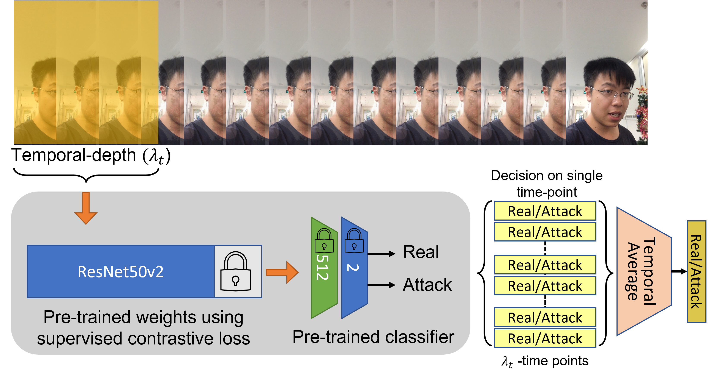

# Leveraging Temporal Depth in Face Presentation Attack Detection

Utilizing depth information in simple RGB modality face PAD databases.

## Model Description

A supervised contrastive learning model with ResNet50v2 as the base encoder network.

## List of Files
1. Face_PAD_Supervised_contrastive_RY.ipynb
2. Depth_experiment_RY.ipynb

## Description of Files
1. File 1 for training and single frame inference
2. File 2 for conducting temporal depth experiment on the trained model obtained from file 1 

## Database Description
ROSE-Youtu Face Liveness Detection Database covers a large variety of illumination conditions, camera models, and attack types. The ROSE-Youtu Face Liveness Detection Database (ROSE-Youtu) consists of 4225 videos with 25 subjects in total (3350 videos with 20 subjects publically available with 5.45GB in size).  It also includes a new Client-Specific One-Class Domain Adaptation Protocol with an additional 1.25GB of pre-processed data.

For each subject, there are 150-200 video clips with the average duration around 10 seconds. Five mobile phones were used to collect the database: (a) Hasee smart-phone (with resolution of 640 * 480), (b) Huawei Smart-phone (with resolution of 640 * 480), (c) iPad 4 (with resolution of 640 * 480), (d) iPhone 5s (with resolution of 1280 * 720) and (e) ZTE smart-phone (with resolution of 1280 * 720). All face videos are captured by a front-facing camera. The standoff distance between face and camera is about 30-50 cm.

For genuine face video, normally there are 25 videos (5 devices with 5 scenes). The scene covers 5 different illumination conditions in office environment. If the client wears eye-glasses, there will be another 25 videos.

There are three spoofing attack types including printed paper attack, video replay attack, and masking attack. For printed paper attack, face image with still printed paper and quivering printed paper (A4 size) are used. For video replay attack, a face video is displayed on Lenovo LCD screen and Mac screen. For masking attack, masks with and without cropping are considered. Moreover, the face videos are captured with different backgrounds which guarantee the face videos are coupled with different illumination conditions. To keep consistent with the genuine face video, the standoff distance between spoofing medium and camera is also about 30-50 cm.

## Results

Temporal Depth | HTER/EER (%)
---------------|-------------
1              |2.53/2.64
10             |1.96/1.33
100            |0.524/0.355
